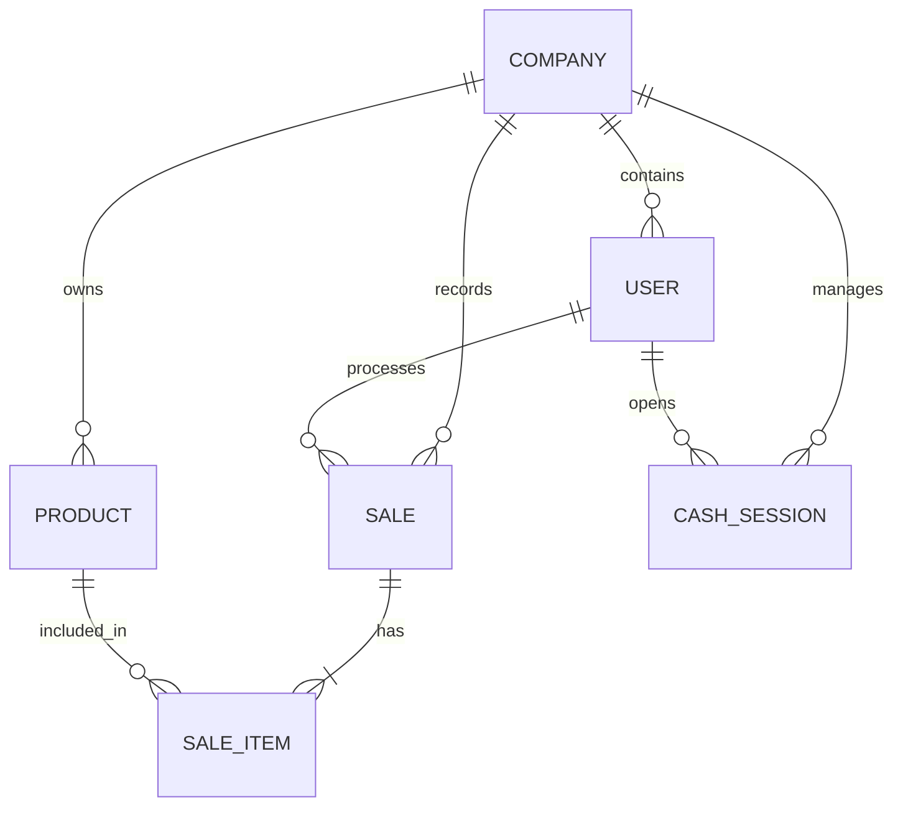

# Entidades de Dominio - CajaClara SAAS

## Modelo de Datos Principal

El sistema utiliza JPA para el mapeo objeto-relacional. Todas las entidades críticas incluyen una relación con `Company` para soportar la multitenencia.

### 1. Empresa (Company)
Representa a un inquilino en el sistema.
- **Atributos**: `id`, `name`, `nit`, `address`, `phone`, `email`.
- **Relaciones**: Es la raíz de la mayoría de las entidades.

### 2. Usuario (User)
Personal que opera el sistema.
- **Atributos**: `id`, `username`, `email`, `password`, `role` (ADMIN, CASHIER, USER), `provider` (LOCAL, GOOGLE).
- **Relaciones**: Pertenece a una `Company`.

### 3. Producto (Product)
Artículos inventariables para la venta.
- **Atributos**: `id`, `code`, `name`, `price`, `stock`, `category`, `status` (ACTIVE, INACTIVE), `img`.
- **Relaciones**: Pertenece a una `Company`.

### 4. Venta (Sale)
Registro de una transacción comercial.
- **Atributos**: `id`, `subtotal`, `tax`, `total`, `payment_method` (CASH, CARD, TRANSFER), `cashier_id`.
- **Relaciones**: 
  - Pertenece a una `Company`.
  - Contiene una lista de `SaleItem`.

### 5. Ítem de Venta (SaleItem)
Detalle de cada producto en una venta.
- **Atributos**: `id`, `quantity`, `unit_price`, `subtotal`.
- **Relaciones**: 
  - Vinculado a una `Sale`.
  - Vinculado a un `Product`.

### 6. Sesión de Caja (CashSession)
Control de flujo de dinero por turno.
- **Atributos**: `id`, `opening_date`, `closing_date`, `initial_balance`, `final_balance`, `status` (OPEN, CLOSED).
- **Relaciones**: 
  - Gestionada por un `User`.
  - Pertenece a una `Company`.

### 7. Servicio (Service)
Órdenes de trabajo o servicios prestados.
- **Atributos**: `id`, `description`, `price`, `status` (PENDING, COMPLETED), `type`.
- **Relaciones**: Pertenece a una `Company`.

---
## Diagrama de Relaciones (Mermaid)

