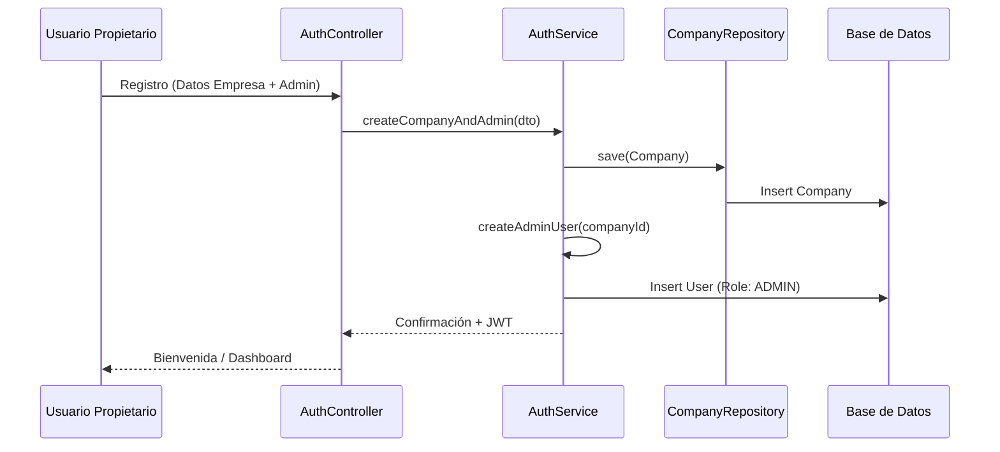
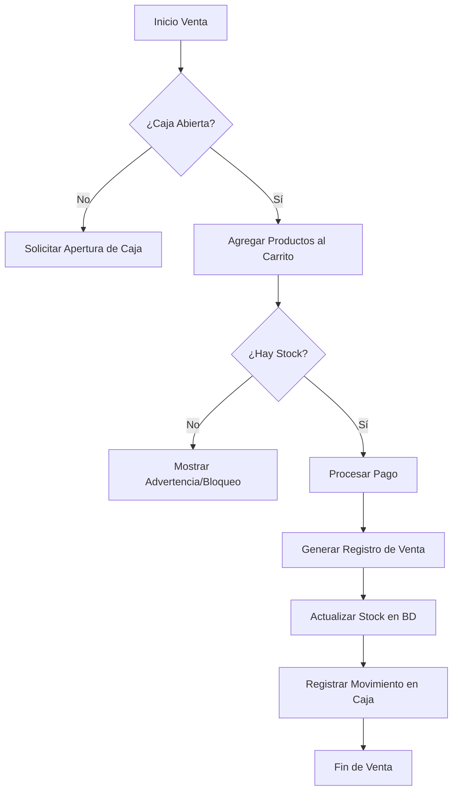
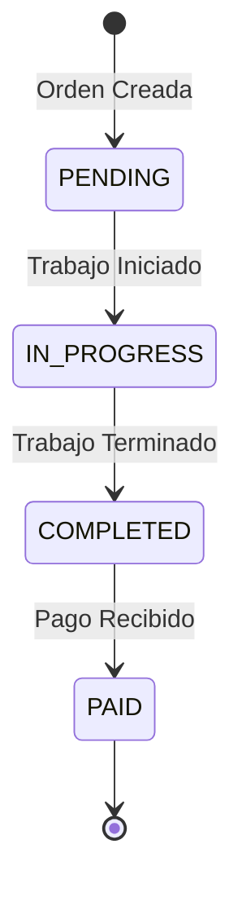

# Workflows - CajaClara SAAS

## 1. Onboarding de Empresa y Usuario

Este flujo describe cómo una nueva empresa se registra en la plataforma.

## 2. Flujo de Venta y Stock

## 3. Gestión de Servicios

